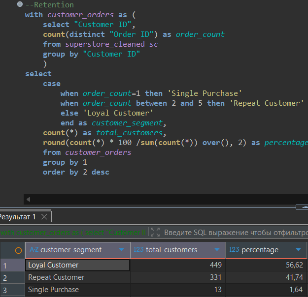
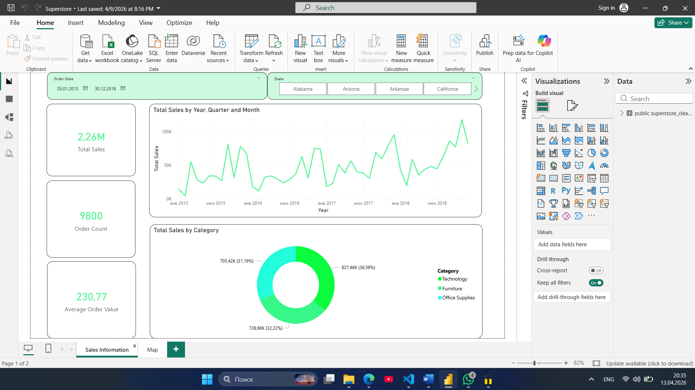
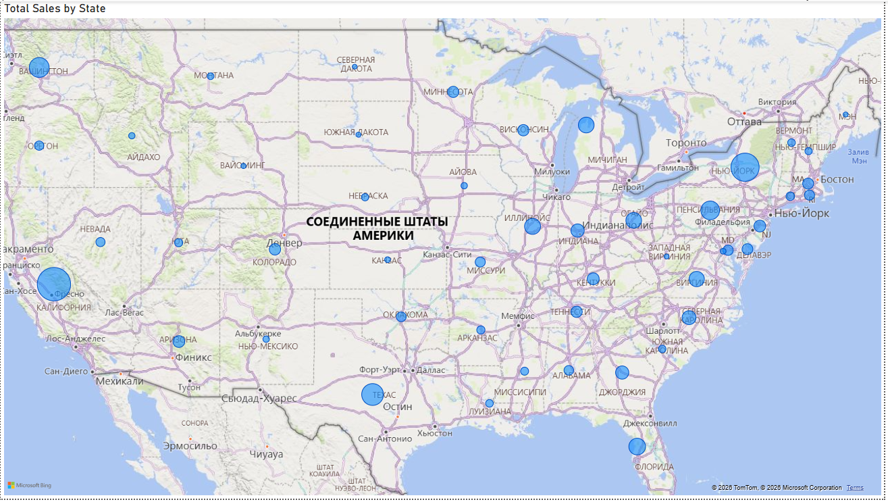

# 📊 Анализ розничных продаж сети Superstore

Комплексный проект по анализу транзакционных данных: от первичной обработки сырого датасета до построения интерактивной BI-отчетности и формирования бизнес-рекомендаций.

##   Стек технологий
* **Python (Pandas):** ETL-процессы, очистка данных (handling missing values) и приведение типов.
* **SQL (PostgreSQL):** Аналитические запросы, сегментация клиентской базы, работа с CTE и оконными функциями.
* **Power BI:** Создание мер на языке DAX, визуализация ключевых KPI и настройка интерактивных дашбордов.

##   Ключевые этапы работы
1. **Data Cleaning (Python):** - Обработаны пропуски в геолокации (`Postal Code`).
   - Столбцы с датами приведены к формату `datetime` для анализа временных рядов.
2. **SQL Аналитика:**
   - Рассчитан общий объем выручки ($2.26M) и средний чек ($230.77).
   - Выявлены штаты-лидеры и наиболее востребованные категории товаров.
   - Проведен **Retention-анализ** для оценки лояльности аудитории.
3. **Визуализация (Power BI):** - Построены отчеты по динамике продаж, долям категорий и географическому распределению.
   - Настроены срезы (фильтры) по регионам и сегментам рынка.

##   Глубокая аналитика: Лояльность клиентов
С помощью SQL-запроса была проведена сегментация базы на разовых и лояльных покупателей:

*Результат:* Более **98%** клиентов являются повторными, что говорит о высоком качестве продукта и стабильном ядре аудитории.

##   Дашборд

*(Интерактивный отчет с фильтрацией по регионам и сегментам)*

## 💡 Бизнес-рекомендации
* **Сезонное планирование:** Учитывая пик продаж в 4-м квартале (Q4), рекомендуется увеличить складские запасы и рекламную активность к октябрю.
* **Фокус на драйверы роста:** Категория **Technology** генерирует максимальную выручку. Расширение ассортимента в этой нише даст наибольший финансовый эффект.
* **Географическая экспансия:** Оптимизация логистики в штатах **California** и **New York** позволит сократить издержки, так как на них приходится основной объем заказов.

---
**Автор:** Акаев Л-А. Л.
