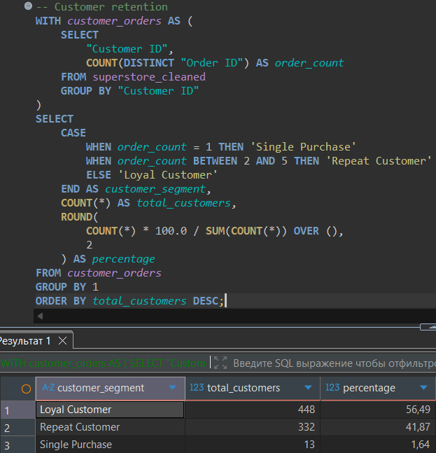
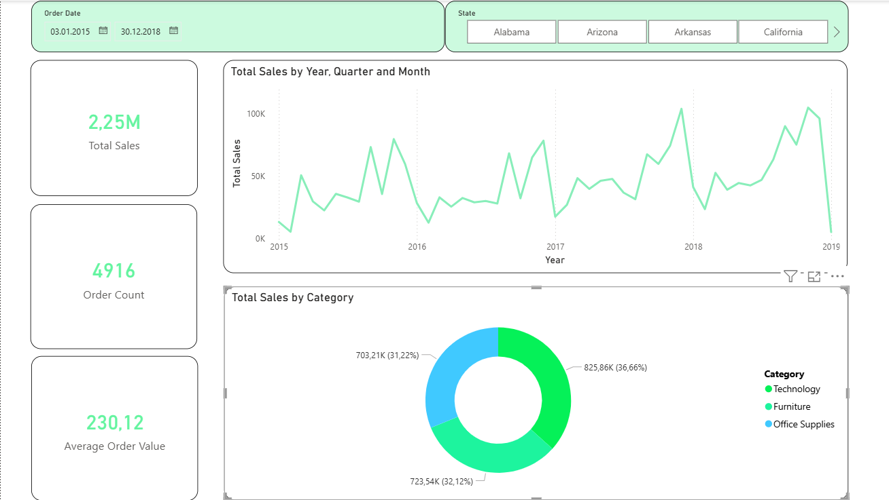
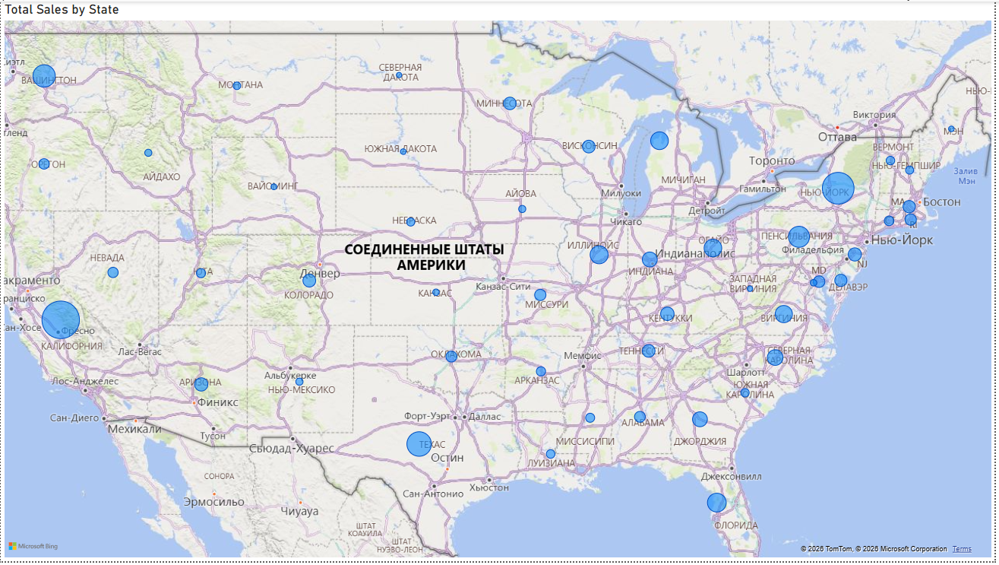

# 📊 Superstore Sales Analysis

End-to-end analysis of retail sales data, covering data cleaning, exploratory analysis, SQL analytics, and interactive BI reporting.

## 🛠️ Tech Stack

- **Python (Pandas)** — data cleaning, preprocessing, data validation, and exploratory analysis.
- **PostgreSQL** — analytical queries, customer segmentation, CTEs, and window functions.
- **Power BI** — KPI development, DAX measures, data visualization, and interactive dashboards.

## 📌 Project Overview

The goal of this project is to analyze retail sales data and identify key trends in revenue, customer behavior, product performance, and geographic distribution.

The project covers the full analytical workflow:

**Raw Data → Data Cleaning → SQL Analysis → Power BI Dashboard → Business Insights**

## 🔧 Data Preparation

Data preprocessing was performed using Python and Pandas.

Key steps:

- Checked the dataset structure and data types.
- Converted `Order Date` and `Ship Date` to datetime format.
- Checked for missing values and duplicates.
- Removed records with missing `Postal Code` values.
- Created additional `Year` and `Month` fields for time-based analysis.
- Validated key metrics after cleaning.
- Exported the cleaned dataset for further SQL and BI analysis.

## 📊 Key Metrics

| Metric | Value |
|---|---:|
| Total Revenue | **$2,252,607.41** |
| Total Orders | **4,916** |
| Average Order Value | **$458.22** |

## 🧮 SQL Analysis

PostgreSQL was used to perform analytical queries, including:

- Total revenue calculation
- Sales analysis by state and category
- Top 10 customers by revenue
- Top 10 products by revenue
- Monthly sales trends
- Average Order Value by customer segment
- Running total using window functions
- Customer segmentation based on purchase frequency

## 👥 Customer Retention

Customers were segmented based on the number of unique orders:

- **Single Purchase** — 1 order
- **Repeat Customer** — 2–5 orders
- **Loyal Customer** — 6+ orders

## 📈 Power BI Dashboard

The cleaned dataset was used to build an interactive Power BI dashboard for analyzing:

- Revenue trends
- Product categories
- Geographic performance
- Customer segments
- Key sales KPIs

## 💡 Business Insights & Recommendations

### Seasonal Planning

Sales activity increases during **Q4**, suggesting that inventory and marketing efforts should be increased ahead of the holiday season.

### Technology as a Growth Driver

**Technology** is the leading category by revenue. Expanding the product assortment and maintaining availability in this category may provide additional revenue opportunities.

### Geographic Performance

**California and New York** are among the strongest markets by sales volume. Optimizing inventory allocation and logistics in these markets could improve operational efficiency.

